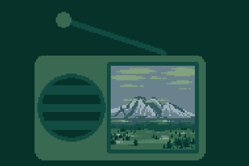

# TunePix

Stylized radio for displaying art and music combo pieces.

I made this mostly for myself, but I also figured it may be useful for others
who make music and pixel art combo pieces and want a way to showcase them! :)

## Getting Started

1. Download version 4.3 of the [Godot Engine](https://godotengine.org/).
2. Download this project and open it within the Godot editor.
3. Click the "play" icon in the top-right of the editor, and you
  should see the scene featured in the GIF at the top of this page!

## Creating your own TunePix

**This requires some basic knowledge of the Godot Engine.**

To make your own visualization, you should have two assets: an **audio file**
and an **image file**. Drag-and-drop both of these files into the Godot
project.

Next, right click in the FileSystem and create a new Resource file.
Search for "TunePixConfig" and select it within the matches. Then
click "Create", and name your resource file. It can be called anything you'd
like.

Open **main.tscn** and click on the **TunePix** node in the scene tree.
In the inspector, drag-and-drop your new TunePixConfig resource onto the
**config** property. The sample TunePix piece should have disappeared.

Now, you can configure your own TunePix piece by clicking on the config
resource (which is still the resource you created earlier) and modifying its
properties. A good place to start is to drag-and-drop your audio file to
**Audio > Stream** and your image file to **Visuals > Art > Texture**.
You should now see a TunePix piece with your image! From here you can
play around with the various configs until you have a piece that you're
satisfied with.

### Other tweaks

If you need to adjust the background color of the scene. Adjust this with the
**ColorRect** node in the scene tree.

If you need to adjust the position of the TunePix piece, do so via the standard
positioning of Control nodes, which can be used on the **TunePix** node.
For a quick re-centering, you can click on the **TunePix** node, click on
the anchor presets on the top of the 2D editor (to the left of the anchor
icon), and then click the "Center" preset.

If you need to adjust the pixel scale of the entire scene. Modify the
**Stretch Shrink** property of the **SubViewportContainer** node.

### Recording

Once you're done, you can export your piece as a video by using Godot's
Movie Maker Mode. You can read about that here:
[Creating movies (docs.godotengine.org)](https://docs.godotengine.org/en/stable/tutorials/animation/creating_movies.html)

## Future Development

Since this project is not my priority, don't expect any of these features in
any sort of timeframe. However, if I feel the itch to work on this some more,
here are some things I would do next:

- Animations support
- A handle on top of the radio
- Background textures for the radio box
- Knobs and other greebles
- More intricate speaker partitions
- Squash-and-stretch to the beat